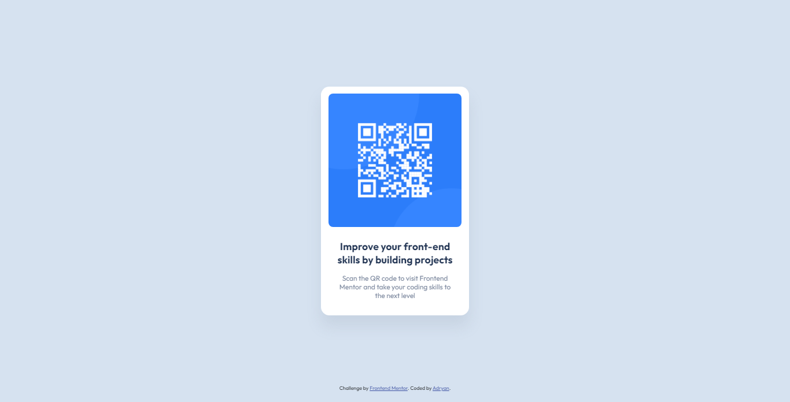

# Frontend Mentor - QR code component solution

This is a solution to the [QR code component challenge on Frontend Mentor](https://www.frontendmentor.io/challenges/qr-code-component-iux_sIO_H). Frontend Mentor challenges help you improve your coding skills by building realistic projects.

It was a easy, but a fun project to make. I just needed to use simple HTML and CSS content.

## Overview

### Screenshot

### Links

- Live site URL: [QR code component](https://iranadryan.github.io/fe-mentor-qr-code-component/)

### Built with

- HTML
- CSS
- Flexbox

## Author

- Frontend Mentor - [@iranadryan](https://www.frontendmentor.io/profile/iranadryan)
- LinkedIn - [iranbatista](https://www.linkedin.com/in/iranbatista/)
